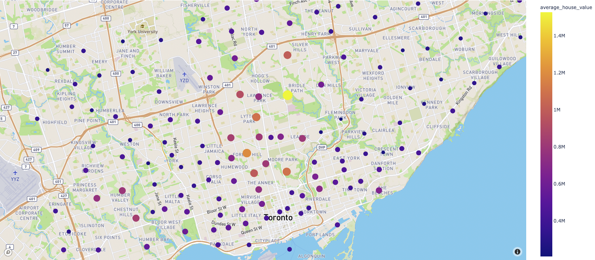

# Toronto housing market visualisation
This repo contains analysis and dashboarding for the toronto housing market. Census data for the period of 2001-2016 was used to generate analysis and visualisations of the greater region of Toronto. 

## Using this repo
The dashboard in this repo requires matplotlib, hvplot, plotly and panel as well as hvplot widgets installed for jupyter notebook. A conda environment with the required installation can run dashboard.ipynb. The dashboard.servable() cell will generate an interactve output which can be browsed by users, the first tab will look similar to below.

